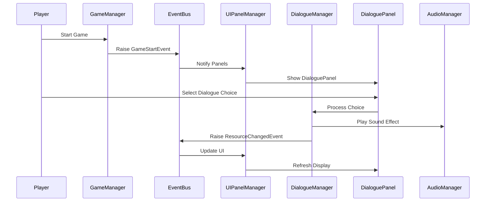
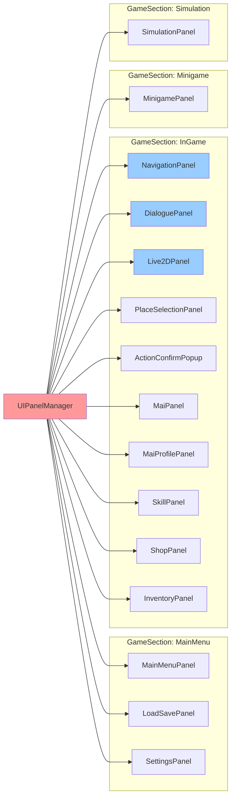
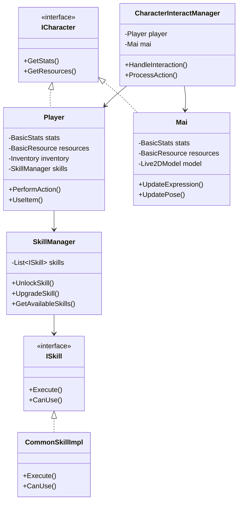
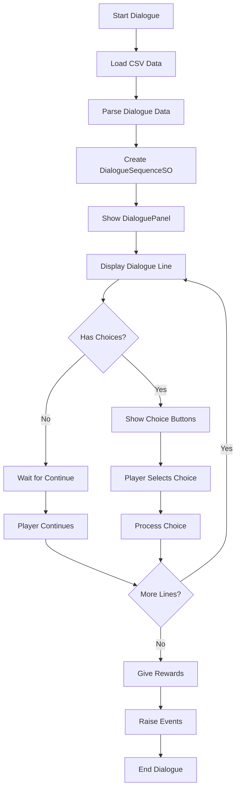
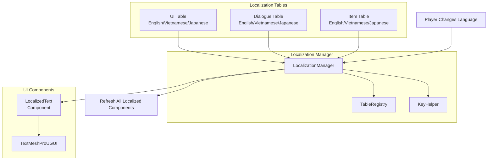
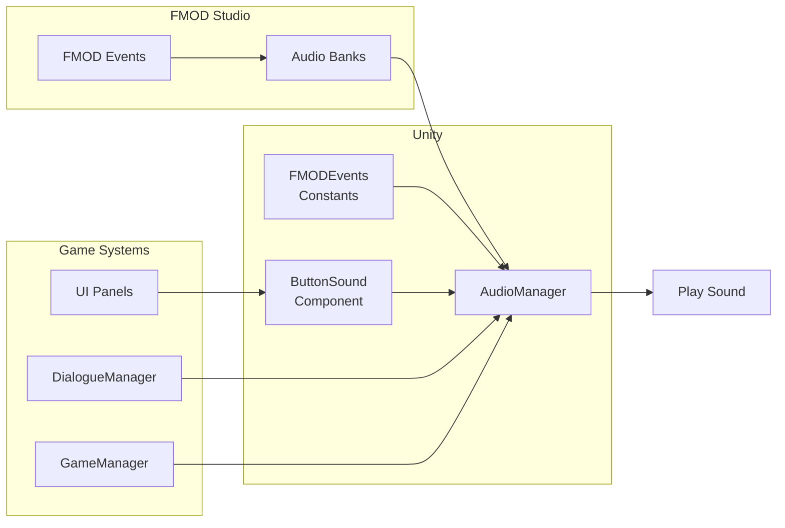
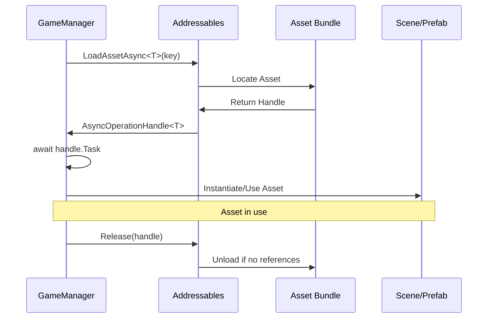

# Mai's Love Story - Architecture Diagram

## System Overview

```mermaid
graph TB
    subgraph "Core Managers (Singletons)"
        GM[GameManager<br/>Game State & Flow]
        DM[DialogueManager<br/>Dialogue System]
        UPM[UIPanelManager<br/>UI Orchestration]
        AM[AudioManager<br/>Audio Playback]
        LM[LocalizationManager<br/>Multi-Language]
        TM[TimeManager<br/>Time Progression]
        DataM[DataManager<br/>Data Persistence]
    end

    subgraph "EventBus System"
        EB[EventBus<br/>Type-Safe Events]
        GSE[GameStartEvent]
        PCE[PlaceChangedEvent]
        TCE[TimeChangedEvent]
        RCE[ResourceChangedEvent]
        SCE[StatsChangedEvent]
    end

    subgraph "UI System"
        subgraph "InGame Section"
            NP[NavigationPanel]
            DP[DialoguePanel]
            L2DP[Live2DPanel]
            PSP[PlaceSelectionPanel]
            ACP[ActionConfirmPopup]
            MP[MaiPanel]
            MPP[MaiProfilePanel]
            SP[SkillPanel]
            ShP[ShopPanel]
            IP[InventoryPanel]
        end
    end

    subgraph "Character System"
        Player[Player<br/>Stats & Resources]
        Mai[Mai<br/>Character State]
        CIM[CharacterInteractManager<br/>Interactions]
        SM[SkillManager<br/>Skill Progression]
    end

    subgraph "Data Systems"
        Inv[Inventory<br/>Item Management]
        ShopM[ShopManager<br/>Shop Transactions]
        ItemDB[ItemDatabase<br/>Item Registry]
    end

    subgraph "External Systems"
        L2D[Live2D Cubism SDK<br/>Character Animation]
        FMOD[FMOD<br/>Audio Middleware]
        Addr[Unity Addressables<br/>Asset Management]
        Loc[Unity Localization<br/>Language Tables]
    end

    GM --> EB
    DM --> EB
    TM --> EB
    Player --> EB
    Mai --> EB

    EB --> NP
    EB --> DP
    EB --> L2DP
    EB --> PSP
    EB --> MP

    UPM --> NP
    UPM --> DP
    UPM --> L2DP
    UPM --> PSP
    UPM --> ACP
    UPM --> MP
    UPM --> MPP
    UPM --> SP
    UPM --> ShP
    UPM --> IP

    DM --> DP
    AM --> FMOD
    LM --> Loc

    CIM --> Player
    CIM --> Mai
    SM --> Player

    ShopM --> Inv
    ShopM --> ItemDB
    Inv --> ItemDB

    L2DP --> L2D
    GM --> Addr

    style GM fill:#ff9999
    style DM fill:#ff9999
    style UPM fill:#ff9999
    style AM fill:#ff9999
    style LM fill:#ff9999
    style EB fill:#99ccff
    style L2D fill:#99ff99
    style FMOD fill:#99ff99
    style Addr fill:#99ff99
    style Loc fill:#99ff99
```

## Data Flow Diagram

## UI Panel Hierarchy

## Character System Architecture

## Dialogue System Flow

## Localization System

## Audio System Integration

## Asset Loading Flow

---

## Legend

- 🔴 **Red** - Core Singleton Managers
- 🔵 **Blue** - EventBus and Events
- 🟢 **Green** - External Systems (Live2D, FMOD, Unity)
- ⚪ **White** - UI Panels and Components

---

**Last Updated**: 2025-11-13  
**Related**: See [CCDK.md](../CCDK.md) for detailed documentation
